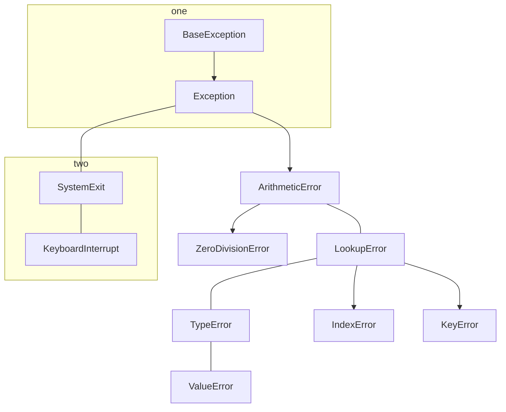

```mermaid
flowchart
    direction LR 
    subgraph one
        direction BT  
        BaseException --> Exception
    end
    subgraph two
        direction LR
        Exception --- SystemExit --- KeyboardInterrupt
    end        
direction BT

Exception --> ArithmeticError --- LookupError --- TypeError --- ValueError

direction BT
ArithmeticError --> ZeroDivisionError
LookupError --> IndexError
LookupError --> KeyError
```

